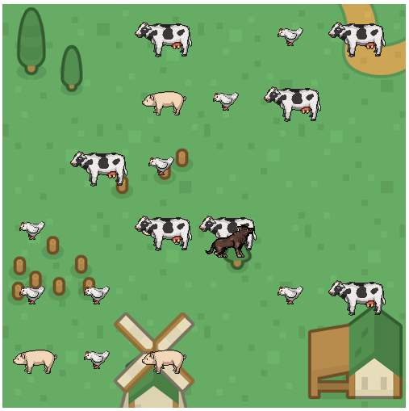

# Villa Platzi

## Bienvenido! 👋

En canvas puedes insertar imágenes, hagámoslo con nuestra villa platzi.

Recuerda:

- Debemos agregar la imagen en el evento load del objeto.
- Debemos usar el método .drawImage del canvas para insertar la imagen.
- Canvas dibuja siempre encima del último objeto.